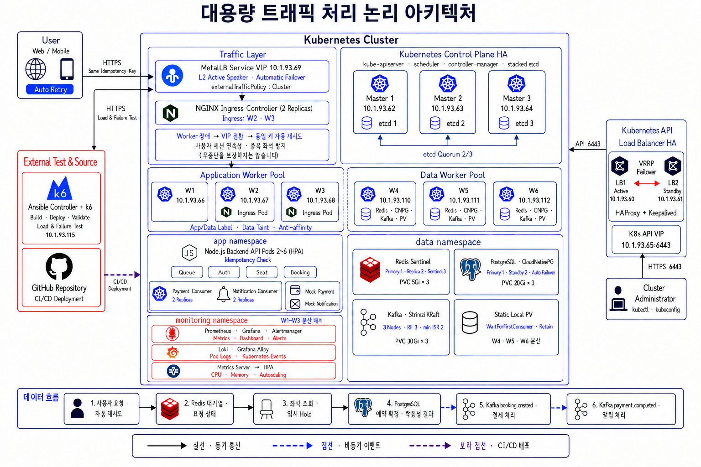
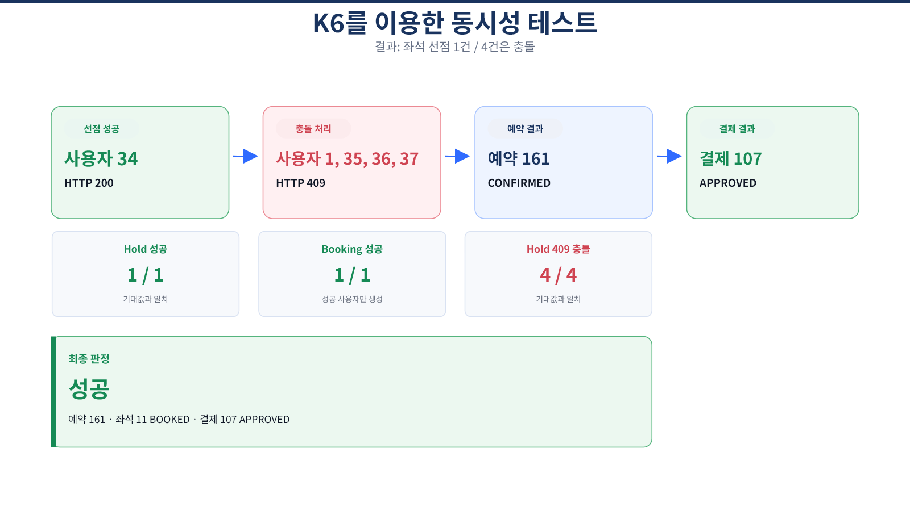
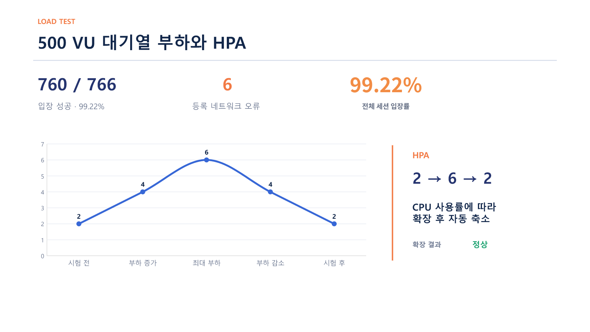

# Ticket Rail

**Kubernetes 기반 대용량 티켓팅 인프라**

트래픽이 집중되는 티켓 예매 환경을 가정해 대기열, 좌석 선점, 예약, 비동기 결제·알림 흐름을 구현하고 부하 및 장애 대응 능력을 검증한 팀 프로젝트입니다.

> **담당 역할** — 4인 팀 Project Lead  
> 요구사항 구체화 · 전체 논리 아키텍처 설계 · 일정 및 역할 조율 · 시험 계획 · 시스템 통합 검증

[한눈에 보기](#프로젝트-한눈에-보기) · [담당 역할](#담당-역할) · [아키텍처](#전체-아키텍처) · [검증 결과](#검증-전략과-결과) · [문제 개선](#검증에서-발견한-문제와-개선) · [사용 기술](#사용-기술)

---

## 프로젝트 한눈에 보기

| 항목 | 내용 |
| --- | --- |
| 기간·인원 | 2026.08 - 2026.09 · 4명 |
| 구축 환경 | 온프레미스 Kubernetes 클러스터 |
| 서비스 흐름 | 대기열 → 좌석 선점 → 예약 → 비동기 결제·알림 |
| 핵심 목표 | 트래픽 급증 대응 · 중복 선점 방지 · 장애 대응 · 배포 자동화 |

### 로컬 실행

Node.js Backend와 로컬 PostgreSQL·Redis 구성을 빠르게 확인할 수 있습니다.

```bash
cp .env.example .env
docker compose -f docker-compose.local.yml up -d
npm ci
npm test
npm start
```

`.env`는 로컬 개발용 예시를 기반으로 생성되며 Git에 포함되지 않습니다. Kubernetes 배포와 부하·장애 시험은 아래 저장소 구조의 각 디렉터리 문서를 참고합니다.

### 핵심 검증 결과

| 검증 항목 | 결과 |
| --- | --- |
| 대기열 부하 | 최대 **500 VU**, 760 / 766개 세션 입장 완료(**99.22%**) |
| 자동 확장 | Backend Pod **2 → 6 → 2** 확장·축소 확인 |
| 좌석 동시성 | 동일 좌석 요청 5건 중 **1건 성공**, 4건 HTTP 409 처리 |
| 좌석 조회 | **430,169건**, 실패 0건 |
| 장애 대응 | Pod·Worker·Control Plane·LB·Redis·PostgreSQL·Kafka **7개 시나리오** 검증 |

> 수치는 명시한 시험 조건과 관측 구간을 기준으로 작성했습니다. 관측된 요청 실패가 없었던 결과를 전체 환경의 절대적인 무중단 보장으로 확대하지 않았습니다.

---

## 담당 역할

| 구분 | 수행 내용 |
| --- | --- |
| 프로젝트 기획·팀 운영 | 프로젝트 목표와 요구사항을 구체화하고, 전체 일정을 수립해 팀원별 역할을 배정하고 진행 상황을 조율 |
| 아키텍처 | 전체 논리 아키텍처 설계, 구성 요소 간 연결 방식 정리 |
| 시험 계획 | 기능·동시성·부하·장애 시험의 조건, 기대 결과, 종료 기준 정의 |
| 통합 검증 | 애플리케이션과 인프라 연동 확인, 시험 수행 및 결과 분석 |
| 문서화·공유 | 기술 이슈와 시험 결과 취합, 최종 보고서와 발표 자료 작성 |

> **역할 구분**  
> Node.js Backend 개발, Kubernetes HA·CI/CD 세부 구현, 모니터링 환경 구축은 각 담당 팀원이 수행했습니다. 이 문서에서는 이를 팀 전체 구현으로 소개하고, 개인 기여는 아키텍처 설계와 시험 계획, 통합 검증을 중심으로 구분했습니다.

### 검증 기준을 세운 방식

- 시험 전에 **조건·기대 결과·종료 기준**을 먼저 정의했습니다.
- 장애 시험은 **장애 주입 → 감지 → 전환 → 서비스 복구 → 전체 구성 복구**로 단계를 나눠 측정했습니다.
- 부하 시험에서는 **최대 동시 실행 수(VU)**와 **전체 실행 세션 수**를 구분했습니다.
- 성공 수치뿐 아니라 시험 범위, 제외 항목, 네트워크 오류도 함께 기록했습니다.

---

## 전체 아키텍처

<p align="center">
  <a href="docs/architecture.png">
    
  </a>
</p>

<p align="center"><sub>이미지를 클릭하면 원본 크기로 확인할 수 있습니다.</sub></p>

| 계층 | 주요 구성 | 역할 |
| --- | --- | --- |
| 접속·분산 | HAProxy, Keepalived, MetalLB, NGINX Ingress | Kubernetes API와 사용자 트래픽 분산 |
| 클러스터 | Control Plane 3대, App Worker 3대, Data Worker 3대 | 제어·애플리케이션·데이터 워크로드 분리 |
| 애플리케이션 | Node.js Backend, HPA | 대기열·좌석·예약 API와 자동 확장 |
| 데이터 | Redis Sentinel, CloudNativePG, Kafka KRaft | 임시 선점, 예약 데이터, 비동기 이벤트 처리 |
| 자동화 | GitHub Actions, GHCR, Ansible | 검증, 이미지 게시, Rolling Update |
| 관측 | Prometheus, Grafana, Loki, Alloy | 지표와 로그 수집 및 조회 |

### 문제 정의와 팀 설계

| 문제 | 적용한 설계 | 확인한 내용 |
| --- | --- | --- |
| 예매 시작 시 트래픽 집중 | Redis 대기열, Backend HPA 2~6개 | 최대 500 VU와 자동 확장·축소 |
| 동일 좌석 중복 요청 | Redis `SET NX EX`, DB 트랜잭션·제약조건 | 5건 중 1건 성공, 4건 충돌 처리 |
| 단일 구성 요소 장애 | Control Plane 3대, API VIP, 복제 구성 | 계층별 7개 장애 시나리오 |
| 반복되는 배포 작업 | GitHub Actions, GHCR, Ansible | SHA 이미지 추적과 Rollout 확인 |

---

## 검증 전략과 결과

`기능 시험` → `동시성 시험` → `부하 시험` → `장애 시험`

기능 구현 여부만 확인하지 않고, 사전에 정한 기대 결과와 실제 측정값을 비교했습니다. 아래 항목을 펼치면 시험 조건과 상세 결과를 확인할 수 있습니다.

<details>
<summary><strong>좌석 동시성 시험</strong> — 5건 중 1건 성공, 4건 HTTP 409</summary>

동일 좌석에 5명이 최대 1ms 차이로 요청하도록 구성했습니다. 한 명만 선점과 예약에 성공했고, 나머지 네 명에게 HTTP 409를 반환했습니다.

| 측정 항목 | 결과 |
| --- | --- |
| 동시 사용자 | 5명 |
| 좌석 선점 성공 | 1건 |
| 충돌 처리 | 4건, HTTP 409 |
| 예상 외 응답 | 0건 |
| 네트워크 실패 | 0건 |



</details>

<details>
<summary><strong>대기열 부하 시험</strong> — 최대 500 VU, 760 / 766개 세션 입장</summary>

대기열 등록부터 입장 확인과 좌석 조회까지 시험했습니다. 전체 766개 세션 중 760개가 입장을 완료했으며, 등록 단계에서 네트워크 오류 6건을 확인했습니다.

| 측정 항목 | 결과 |
| --- | --- |
| 최대 동시 실행 수 | 500 VU |
| 입장 완료 | 760 / 766, 99.22% |
| 등록 네트워크 오류 | 6건 |
| 좌석 조회 | 430,169건, 실패 0건 |
| Backend Pod | 2개 → 6개 → 2개 |

예약과 결제 성능은 시험 범위에서 제외했습니다. `500 VU`는 최대 동시 실행 수이며, 한 VU가 여러 세션을 수행해 전체 766개 세션이 시작됐습니다.



</details>

<details>
<summary><strong>장애 시험</strong> — 7개 계층별 전환·복구 시나리오</summary>

| ID | 장애 대상 | 핵심 결과 |
| --- | --- | --- |
| P-01 | NGINX Pod | 대체 Pod Ready 3.968초, HTTPS 23 / 23 성공 |
| N-01 | Application Worker W2 | 관측 구간 147 / 147 성공, 남은 Worker로 트래픽 재분배 |
| C-01 | Control Plane M1 | Kubernetes API 127 / 127 성공, 서비스 재가동 후 Ready 1.396초 |
| L-01 | Active API LB1 | API VIP 전환 2.423초, Probe 30 / 30 성공 |
| D-01 | Redis Primary | Replica 승격 7.905초, Marker 데이터 보존 |
| D-02 | PostgreSQL Primary | Standby 승격 182.718초, Marker 데이터 보존 |
| D-03 | Kafka Broker | ISR와 대체 UID 확인 28.689초, Marker 메시지 보존 |

</details>

---

## 검증에서 발견한 문제와 개선

| 발견한 문제 | 원인 | 팀 개선 및 재검증 |
| --- | --- | --- |
| 장시간 대기 중 토큰 만료 | 시험 시간보다 짧은 TTL | TTL을 600초에서 3,900초로 조정한 뒤 재시험 |
| 대기열 지표 의미 불일치 | 현재 입장자와 누적값 혼용 | 지표를 분리해 판정 기준 명확화 |
| 시험 결과 경로 불일치 | 실행 중 timestamp 재계산 | Run 시작 시 결과 경로 고정 |
| 배포 이미지 추적 어려움 | 변경 가능한 이미지 태그 | Git SHA 기반 불변 태그 적용 |

---

## 프로젝트 범위와 한계

- 결제와 알림은 외부 서비스가 아닌 Mock으로 구현했습니다.
- 500 VU 시험은 대기열과 좌석 조회 중심이며 예약·결제 부하는 포함하지 않았습니다.
- Worker 장애 시험은 노드 식별용 경량 Probe를 사용했으며 실제 예약 API 부하 시험과 구분했습니다.
- 모니터링 환경은 팀원이 담당했으며 개인 기술 스택으로 포함하지 않았습니다.

---

## 사용 기술

### 개인 담당과 검증에 활용

| 분류 | 기술 |
| --- | --- |
| 시스템·컨테이너 | Linux, Kubernetes, Docker |
| 자동화·배포 검증 | Ansible, GitHub Actions |
| 부하·동시성 시험 | k6 |

### 팀 프로젝트 전체 구성

| 분류 | 기술 |
| --- | --- |
| 트래픽·고가용성 | NGINX Ingress, MetalLB, HAProxy, Keepalived |
| 데이터·메시징 | Redis Sentinel, PostgreSQL CloudNativePG, Kafka KRaft |
| CI/CD·자동화 | GitHub Actions, GHCR, Ansible |
| 관측 | Prometheus, Grafana, Loki, Alloy |
| 시험 | k6 |

<details>
<summary><strong>저장소 구조 보기</strong></summary>

```text
.
├── .github/workflows/       # CI/CD workflow
├── ansible/                 # 클러스터·배포·CI/CD·모니터링 자동화
├── k8s/                     # 애플리케이션·데이터·네트워크 Manifest
├── services/                # 비동기 Consumer와 Mock 서비스
├── src/                     # Node.js Backend
├── test/                    # Node.js 단위·계약 테스트
├── tests/                   # k6·동시성·부하·장애 시험
├── scripts/                 # 관리자 VM 설정 및 개발 보조 스크립트
├── docs/                    # 아키텍처와 검증 결과 이미지
├── .env.example
├── Dockerfile
└── docker-compose.local.yml
```

</details>
